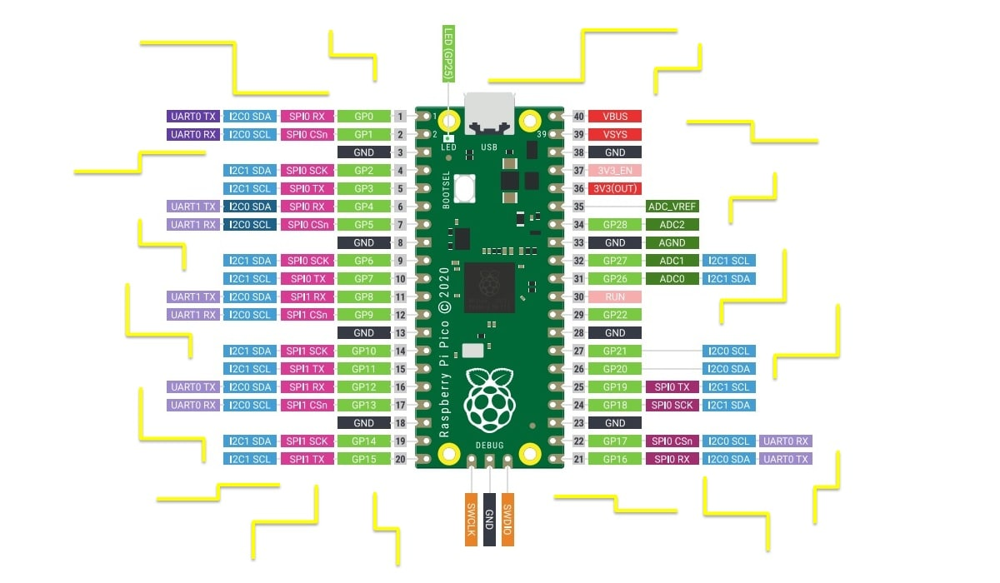

# Quadruped Robot On Raspberry pi Pico
## Hardware

[](https://www.youtube.com/watch?v=42VeJgC9H7w)
___




## Software
Libraries:
```C
    #include "pico/stdlib.h"
    #include <iostream>
    #include "hardware/pwm.h"
    #include "pico/binary_info.h"
    #include "hardware/clocks.h"
    #include "hardware/i2c.h"
    #include <math.h>
```

Data Structure

```c
    class Leg {       //Creating Leg class and its ingredients
    public:
        Ang lastAng;
        Pos lastPos;
        Servo servo[3];
        void toPos(double posX, double posY, double posZ);
        void toAng(double al, double bet , double gam );
        void step (double posX, double posY, double posZ);
        void slide(double posX, double posY ,double posZ);
    };
```


References:
- 
  
You can also check up [Pico C++ Documentation](https://datasheets.raspberrypi.com/pico/raspberry-pi-pico-c-sdk.pdf) where you can find many information about PWM commands and controlling MPU6050.